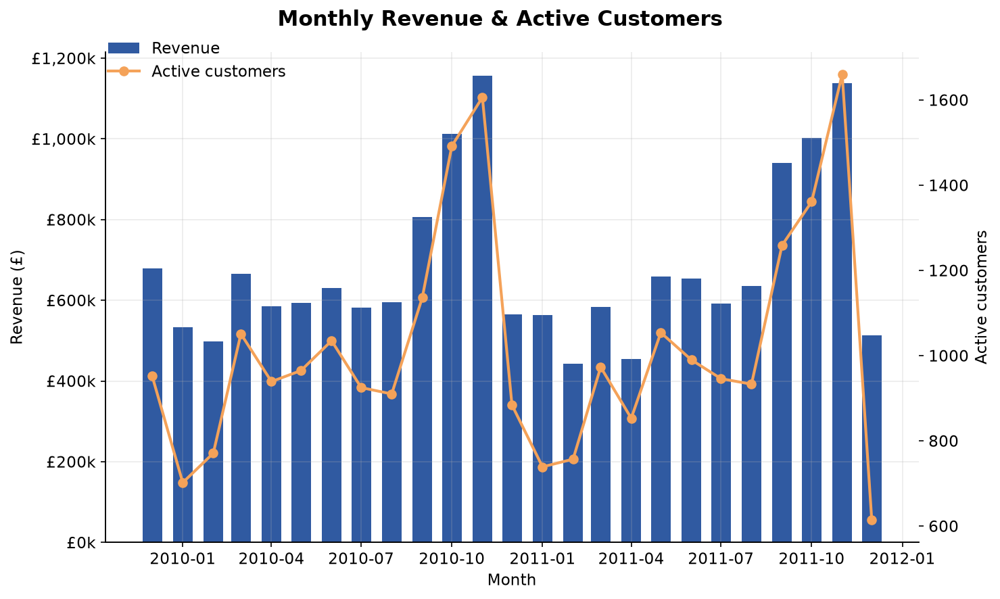
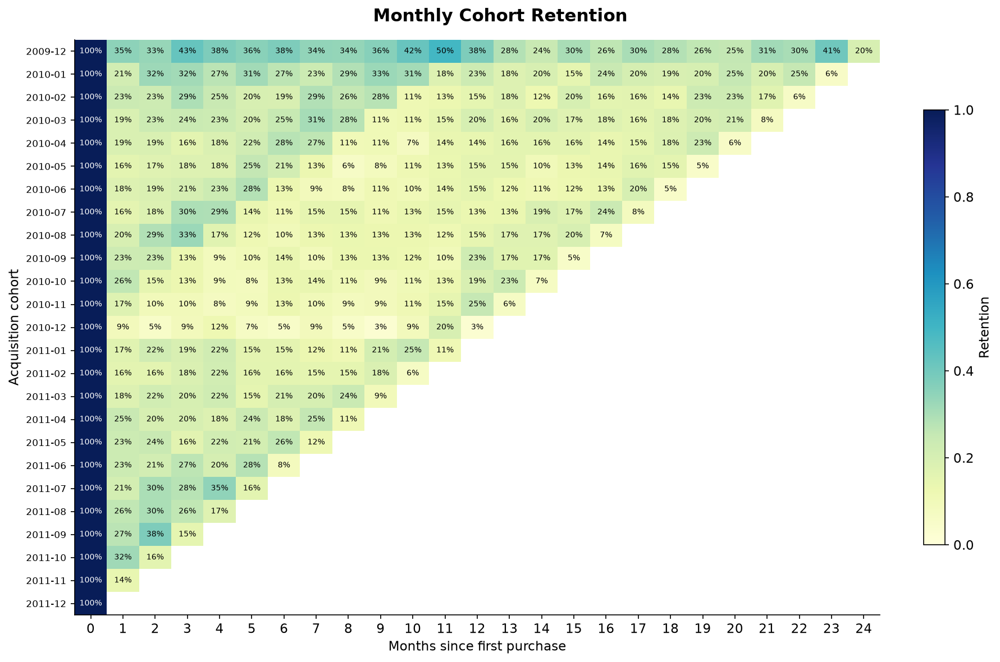
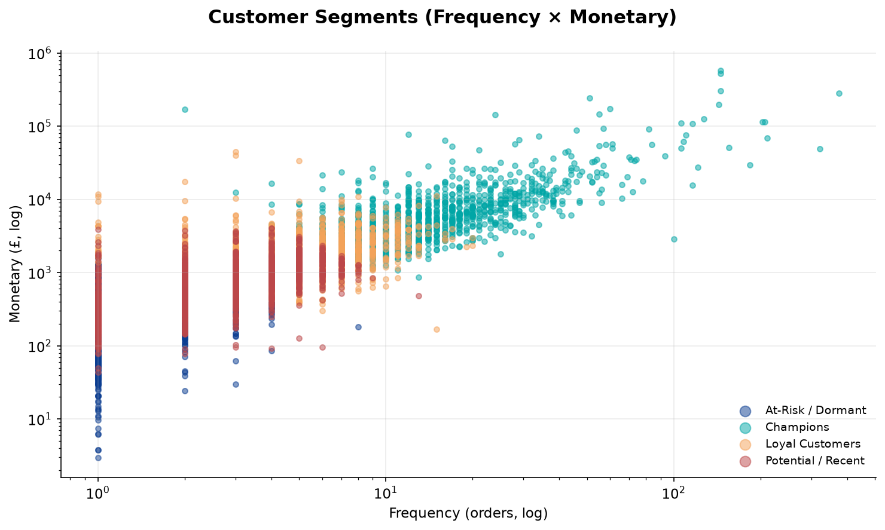
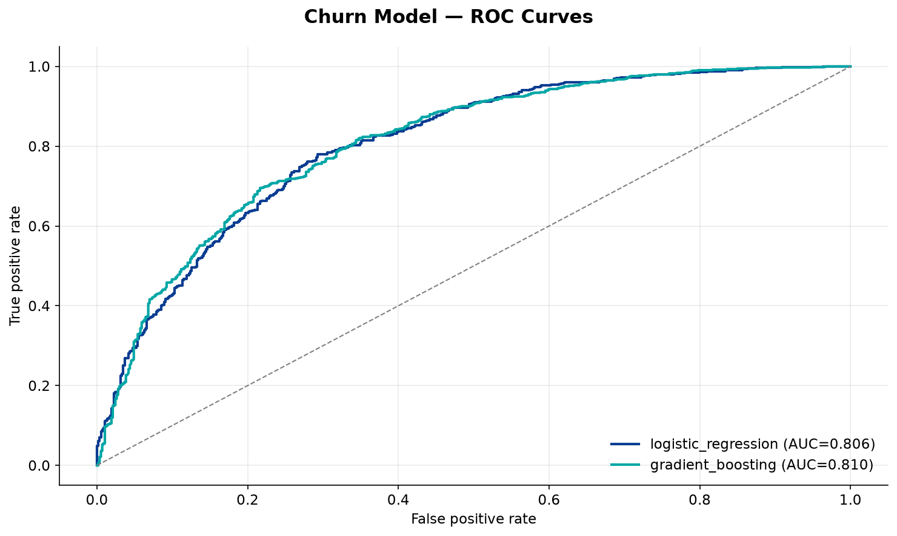

<h1 align="center">Retail Sector Market Research &amp; Customer Intelligence</h1>

<p align="center">
  <em>An end-to-end data science project — from a raw 1M-row transaction log to
  market research, customer segments, retention insight, cross-sell rules and a
  deployed churn model.</em>
</p>

<p align="center">
  
  
  
  
  
</p>

---

## 1. Business problem

A UK-based online gift retailer wants to grow revenue but has no idea *where the
growth is*. Leadership can see top-line sales but cannot answer the questions
that actually drive strategy:

> *Who are our most valuable customers, and how many are quietly slipping away?
> Which products should we bundle? Are we too dependent on one market? If we
> could only call 500 customers next month to stop them churning, **which 500**?*

This project turns two years of raw transactions into the evidence to answer all
of them — and ships a model that scores every customer's churn risk.

**Dataset.** [Online Retail II](https://archive.ics.uci.edu/dataset/502/online+retail+ii)
(UCI Machine Learning Repository; also widely used on Kaggle) — **1,067,371**
real transactions from **Dec 2009 → Dec 2011**, spanning 40+ countries. No
synthetic data.

## 2. Headline results

| | |
|---|---|
| 💷 **£17.1M** revenue analysed across **36.6K** orders and **5.9K** customers | 🎯 **77%** of revenue comes from the top **20%** of customers (Pareto confirmed) |
| 🧩 **4 customer segments** discovered — *Champions* are 20% of buyers but **74%** of revenue | 📉 **Month-1 retention just 21%** — the business is acquisition-heavy, loyalty-light |
| 🛒 **18 cross-sell rules** mined, top association at **13.9× lift** | 🤖 **Churn model ROC-AUC 0.81**, catching **83%** of future churners |

> A full stakeholder-facing write-up with recommendations lives in
> **[`reports/executive_summary.md`](reports/executive_summary.md)** — generated
> automatically by the pipeline.

## 3. What's inside (skills demonstrated)

| Area | Techniques |
|---|---|
| **Data engineering** | Multi-sheet Excel ingestion, business-rule cleaning (cancellations, returns, service codes, missing IDs), Parquet columnar storage, config-driven pipeline |
| **Analytics** | KPI framework, revenue/geo/product EDA, Pareto analysis, **cohort retention** triangles, **market-basket analysis** (Apriori / association rules) |
| **Machine learning** | **RFM** feature engineering, **K-Means** segmentation with elbow + silhouette model selection, **gradient-boosted churn classifier** with a leakage-safe temporal split |
| **Software engineering** | Installable `src/` package, CLI orchestrator, YAML config, **pytest** suite (18 tests), **ruff** linting, **GitHub Actions** CI on Py 3.10–3.12, `Makefile` |
| **Communication** | Auto-generated executive summary, consistent figure theme, reproducible reports |

## 4. Selected visuals

| Monthly revenue &amp; active customers | Cohort retention |
|---|---|
|  |  |

| Customer segments (RFM → K-Means) | Churn model — ROC |
|---|---|
|  |  |

<sub>All eight figures are in [`reports/figures/`](reports/figures).</sub>

## 5. How it works

```
                ┌─────────────┐   business-rule    ┌──────────────┐
  UCI  ───────► │  download   │ ─── cleaning ────► │ clean parquet│
 (.xlsx)        └─────────────┘                    └──────┬───────┘
                                                          │
                   ┌──────────────────────────────────────┼───────────────────────┐
                   ▼                    ▼                  ▼                        ▼
             ┌───────────┐      ┌──────────────┐   ┌───────────────┐      ┌────────────────┐
             │    EDA    │      │   cohort     │   │ RFM features  │      │ market basket  │
             │  (KPIs,   │      │  retention   │   │      │        │      │   (Apriori)    │
             │ geo, prod)│      └──────────────┘   │      ▼        │      └────────────────┘
             └───────────┘                         │ ┌──────────┐  │
                                                   │ │ K-Means  │  │      ┌────────────────┐
                                                   │ │ segments │  │      │  churn model   │
                                                   │ └──────────┘  │      │ (temporal split│
                                                   └───────────────┘      │  + gradient-   │
                                                                          │   boosting)    │
                                                                          └────────────────┘
                             all stages ──► reports/ (figures, CSVs, metrics.json, summary) + models/
```

Every stage is a small, testable function; the [`pipeline`](src/sector_research/pipeline.py)
module wires them together behind a single CLI and writes a consolidated
`metrics.json` plus the executive summary.

### Methodology notes

- **Cleaning is explicit and auditable.** 1,067,371 → 776,840 rows, dropping
  cancellations (19.5K), missing customer IDs (240.6K), service/admin line items,
  non-positive quantity/price, and exact duplicates — each rule logged with counts.
- **Segmentation model selection.** `k` is scanned by both elbow (inertia) and
  silhouette. Silhouette technically favours `k=2`, but that collapses the
  business into "big vs small"; `k=4` is chosen for *actionable* granularity —
  a deliberate analyst judgment, documented rather than hidden.
- **No target leakage in churn.** Features are built only from behaviour *before*
  a cutoff date (`max_date − 90 days`); the label is whether the customer
  returns in the 90-day holdout *after* it. We predict the future from the past,
  never the reverse.

## 6. Quick start

```bash
# 1. Install (creates an editable package with all deps)
make setup            # or: pip install -r requirements-dev.txt && pip install -e .

# 2. Run the whole thing (downloads ~46 MB, runs in a few minutes)
make pipeline         # or: python -m sector_research.pipeline all

# 3. Explore the outputs
open reports/executive_summary.md
open reports/figures/
```

Run an individual stage: `python -m sector_research.pipeline segment`
(stages: `clean`, `features`, `eda`, `cohort`, `segment`, `basket`, `churn`, `all`).

Score new customers with the saved model:

```python
import joblib, pandas as pd
bundle = joblib.load("models/churn_model.joblib")
model, features = bundle["model"], bundle["features"]
risk = model.predict_proba(new_customers[features])[:, 1]   # churn probability
```

## 7. Development

```bash
make test     # pytest (18 tests, synthetic fixtures — no download needed)
make lint     # ruff
```

CI runs lint + the full test matrix on Python 3.10 / 3.11 / 3.12 for every push
and PR (`.github/workflows/ci.yml`).

## 8. Project layout

```
sector-market-research/
├── config/config.yaml            # single source of truth for the pipeline
├── src/sector_research/
│   ├── data/        download.py · clean.py        # ingestion + cleaning
│   ├── features/    rfm.py                         # RFM & behavioural features
│   ├── analysis/    eda.py · cohort.py · market_basket.py
│   ├── models/      segmentation.py · churn.py
│   ├── viz/         theme.py                        # shared figure identity
│   └── pipeline.py                                  # CLI orchestrator
├── tests/                        # pytest suite (18 tests)
├── reports/         figures/ · executive_summary.md · metrics.json · *.csv
├── models/          churn_model.joblib
└── .github/workflows/ci.yml
```

## 9. Possible extensions

- Probabilistic **CLV** (BG/NBD + Gamma-Gamma) on top of the RFM base.
- **SHAP** explanations for individual churn scores.
- Package the scorer behind a small **FastAPI** service + a Streamlit dashboard.
- Schedule monthly retraining and drift monitoring.

---

<sub>Data: UCI Online Retail II (Chen, D., 2019). Code licensed under
[MIT](LICENSE). Built as a portfolio project.</sub>
