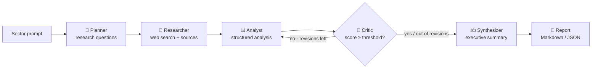

# Sector Market Research — a self-correcting multi-agent analyst

Turn a single sector prompt into a **source-backed, decision-grade market-research
report** — written, critiqued, and revised by a team of Claude agents that hold
themselves to a quality bar before they hand the report over.

```bash
sector-research "commercial drone delivery" -o report.md
```

Built on the [Anthropic API](https://docs.claude.com) with `claude-opus-4-8`, adaptive
thinking, and the server-side web-search tool.

---

## Why this exists

Single-prompt "write me a market report" calls produce fluent text with no evidence,
no review, and no way to tell a strong answer from a hallucinated one. This project
treats a research report the way a consultancy does: **plan the work, gather evidence,
synthesise, then review and revise until it meets a standard.**

The interesting engineering is the **self-correcting quality gate** — the pipeline
does not trust its own first draft. A critic agent scores every draft against the
evidence, and while the score sits below a configurable threshold the analyst is sent
back to fix the *specific* gaps the critic named. Quality is enforced by the system,
not assumed.

## How it works



| Agent | Responsibility | Output contract |
|-------|----------------|-----------------|
| **Planner** | Decompose the sector into sharp research questions | `ResearchPlan` |
| **Researcher** | Answer each question with live web search, capturing sources | `ResearchFinding[]` |
| **Analyst** | Synthesise findings into overview, sizing, trends, competitors, SWOT | `SectorAnalysis` |
| **Critic** | Score the draft against the evidence and name concrete gaps | `Critique` |
| **Synthesizer** | Distil the accepted analysis into an executive summary | `ExecutiveSummary` |

Every hand-off is a typed [Pydantic](https://docs.pydantic.dev) model, so each agent is
developed, validated, and tested in isolation — the orchestrator is the only component
that knows the shape of the pipeline.

## Design principles

- **Resilience over optimism.** The model layer handles retries (via the SDK),
  structured-output failures, and safety refusals as typed exceptions. A single failed
  web search degrades to a low-confidence finding instead of sinking the whole report.
- **Testable to the core.** The network lives behind one injectable `LLMClient`, so the
  entire pipeline — including the critique-and-revise loop — runs deterministically in
  tests with zero API calls.
- **Honest output.** Findings carry a confidence flag derived from how many sources
  corroborated them; the report ships with the critic's score and outstanding notes
  attached. The reader can see how much to trust it.
- **Clean seams.** Config, model layer, agents, orchestration, and rendering are
  separate modules. Swap the CLI for a web service without touching the pipeline.

## Quick start

```bash
# 1. Install
python -m venv .venv && source .venv/bin/activate
pip install -e ".[dev]"

# 2. Configure
cp .env.example .env        # then add your ANTHROPIC_API_KEY

# 3. Run
sector-research "electric vehicle charging networks" -o report.md
sector-research "quantum computing" --format json          # JSON to stdout
sector-research "urban vertical farming" --no-web          # model knowledge only
```

See a rendered example in [`examples/sample_report.md`](examples/sample_report.md).

### Options

| Flag | Purpose |
|------|---------|
| `-o, --output PATH` | Write the report to a file (`.md`/`.json` picks the format) |
| `-f, --format {markdown,json}` | Output format when writing to stdout |
| `--no-web` | Disable web search; research from model knowledge only |
| `-q, --quiet` | Suppress live progress on stderr |

Tunable via environment variables (see [`.env.example`](.env.example)): model, effort,
token ceilings, retry count, web-search cap, quality threshold, and max revisions.

## Development

```bash
make install     # editable install with dev extras
make test        # pytest with coverage
make lint        # ruff
make typecheck   # mypy (strict)
make check       # lint + typecheck + test
```

The suite runs entirely offline. CI (GitHub Actions) runs lint, type-check, and tests
on Python 3.11 and 3.12 for every push and pull request.

## Project layout

```
src/sector_research/
├── config.py         # typed settings from env / .env
├── exceptions.py     # explicit error hierarchy
├── models.py         # Pydantic contracts between agents
├── llm.py            # resilient Anthropic client wrapper
├── agents/           # planner, researcher, analyst, critic, synthesizer
├── orchestrator.py   # pipeline + self-correcting quality gate
├── report.py         # Markdown rendering
└── cli.py            # command-line interface
```

## License

[MIT](LICENSE).
